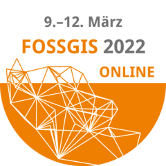

# FOSSGIS 2022 Workshop PostgreSQL/PostGIS für Einsteiger (Marburg Online)

https://www.fossgis-konferenz.de/2022/

[FOSSGIS 2022 Workshop Marburg](https://www.fossgis-konferenz.de/2022/)

 

-> hier geht es zum Workshop https://github.com/astroidex/fossgis-2022-workshop-postgresql-postgis-fuer-einsteiger-aemde/blob/main/fossgis-2022-workshop-postgresql-postgis-fuer-einsteiger-aemde.md

## Astrid Emde

* Astrid Emde
* WhereGroup GmbH
* astrid.emde@wheregroup.com
* [@astroidex](https://twitter.com/astroidex)

## weitere Workshops

* siehe auch PostgreSQL/PostGIS für Fortgeschrittene https://github.com/astroidex/fossgis-2018-workshop-postgresql-postgis-fuer-fortgeschrittene-aemde/blob/master/README.md 

